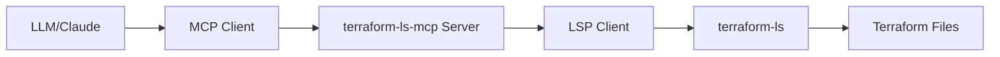

# Terraform LS MCP Server

Terraform Language Server (terraform-ls)をModel Context Protocol (MCP) Server として公開し、LLMがTerraformコードを能動的に操作できるようにするプロジェクトです。

## 概要

このプロジェクトは、HashiCorpのterraform-lsをMCP Server として包装することで、以下の機能をLLMに提供します：

- **terraform_validate**: Terraformファイルの構文検証
- **terraform_format**: Terraformファイルのフォーマット
- **terraform_completion**: Terraform設定の補完候補取得

## インストール

### 前提条件

- Go 1.21 以上
- terraform-ls がインストール済み

terraform-lsのインストール：
```bash
brew install hashicorp/tap/terraform-ls
```

### ビルド

```bash
git clone https://github.com/ryu-ch/terraform-ls-mcp.git
cd terraform-ls-mcp
go build -o terraform-ls-mcp .
```

## 使用方法

### MCP Serverとして起動

```bash
./terraform-ls-mcp serve
```

サーバーはstdin/stdoutを使用してMCPプロトコルで通信します。

### Claude Codeでの使用

Claude Codeの設定ファイル（`~/.claude/mcp_servers.json`）に以下を追加：

```json
{
  "terraform-ls": {
    "command": "/path/to/terraform-ls-mcp",
    "args": ["serve"]
  }
}
```

## 提供される機能（Tools）

### terraform_validate

Terraformファイルの構文を検証します。

**パラメータ:**
- `workspace_path`: Terraformワークスペースのパス
- `file_path`: 検証するTerraformファイルのパス
- `content`: ファイルのコンテンツ

**例:**
```json
{
  "name": "terraform_validate",
  "arguments": {
    "workspace_path": "/path/to/terraform/workspace",
    "file_path": "/path/to/main.tf",
    "content": "resource \"aws_instance\" \"example\" {\n  ami = \"ami-12345\"\n}"
  }
}
```

### terraform_format

Terraformファイルをフォーマットします。

**パラメータ:**
- `workspace_path`: Terraformワークスペースのパス  
- `file_path`: フォーマットするTerraformファイルのパス
- `content`: ファイルのコンテンツ

### terraform_completion

指定した位置でのTerraform設定の補完候補を取得します。

**パラメータ:**
- `workspace_path`: Terraformワークスペースのパス
- `file_path`: 補完を行うTerraformファイルのパス
- `content`: ファイルのコンテンツ
- `line`: 行番号（0ベース）
- `character`: 文字位置（0ベース）

## アーキテクチャ



### 主要コンポーネント

- **MCP Server** (`pkg/mcp`): MCPプロトコルの実装
- **LSP Client** (`pkg/lsp`): terraform-lsとの通信を管理
- **Terraform Client** (`pkg/terraform`): Terraform固有のロジック

## 開発

### テスト実行

```bash
go test ./...
```

### デバッグ

terraform-lsとの通信をデバッグする場合：

```bash
# terraform-lsのログ出力を有効にする
export TF_LOG=DEBUG
./terraform-ls-mcp serve
```

## ライセンス

MIT License

## 貢献

Issues や Pull Requests は歓迎します。

## 参考資料

- [terraform-ls](https://github.com/hashicorp/terraform-ls)
- [Model Context Protocol](https://modelcontextprotocol.io/)
- [Language Server Protocol](https://microsoft.github.io/language-server-protocol/)